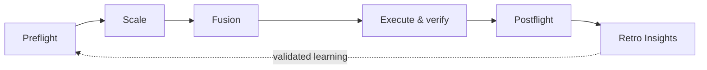

# Agent Skills for Enterprise Transformation

[中文](README.md) · [Agent Skills standard](https://agentskills.io/)

Five Agent Skills for evidence-led transformation inside established enterprises:

1. `preflight` — look for precedents before building.
2. `scale` — trace relationships until a workable boundary appears.
3. `fusion` — absorb useful ideas and form an original, coherent solution.
4. `postflight` — verify completion, recovery, maintenance, and handoff.
5. `retro-insights` — turn repeated experience into the next testable improvement.



## Why this repository exists

Transformation in an established enterprise rarely begins on a blank page. Existing workflows, legacy systems, organizational boundaries, compliance, vendors, frontline experience, and past commitments all shape what can work.

These skills do not prescribe one universal transformation playbook. They provide lightweight decision gates that help people and AI:

- learn from the outside world without copying it;
- preserve cross-cutting relationships while choosing a temporary working boundary;
- build an original solution instead of assembling a feature collage;
- require evidence before declaring work complete;
- promote only repeated, validated lessons into long-term rules.

The public edition was derived from real working methods but has been sanitized. It contains no company, client, project, location, internal system, account, local path, production log, or identifiable business case. All scenarios are synthetic composites.

## Personal position

I do not see established enterprises as obsolete objects waiting to be “fixed” by technology. They contain hard-won experience, relationships, and constraints, as well as genuine inertia and cost. Transformation should understand before it chooses, validate locally before it scales, and avoid worshipping either the past or new technology.

The outside world comes before internal imagination. Boundaries are temporary hypotheses for a decision. Innovation is recombination after understanding. Completion requires evidence. Experience becomes learning only when it changes the next action.

## Install

With a compatible Skills CLI:

```bash
npx skills add Kyoyen/agent-skills-for-enterprise-transformation
```

Or install manually:

```bash
git clone https://github.com/Kyoyen/agent-skills-for-enterprise-transformation.git
mkdir -p ~/.agents/skills
cp -R agent-skills-for-enterprise-transformation/skills/* ~/.agents/skills/
```

Restart or refresh your Agent Skills client after installation.

## Typical uses

- Evaluate an AI tool, platform, or workflow before committing to a build.
- Untangle a cross-functional problem that keeps expanding.
- Reconcile an internal proposal with external best practices.
- Close a pilot with acceptance, rollback, ownership, and maintenance evidence.
- Review repeated human–agent work without mistaking activity metrics for value.

See the full Chinese README for the philosophy, catalog, boundaries, and sanitized enterprise examples.

## Contributing and contact

Sanitized experience reports, issues, discussions, and pull requests are welcome. Read [CONTRIBUTING.md](CONTRIBUTING.md) and [PRIVACY.md](PRIVACY.md) first.

License: [MIT](LICENSE)

Email: [lumon.merrifort@foxmail.com](mailto:lumon.merrifort@foxmail.com)
