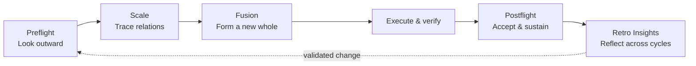

# Thinking Workflow Agent Skills

<p>
  <a href="README.md">中文</a> ·
  <a href="https://agentskills.io/">Agent Skills standard</a>
</p>

<p align="center">
  
</p>

I come from the humanities and social sciences, previously taught history, and now work at the frontier of FDE. I am glad to share these Skills with people exploring Vibe Coding, learning how AI workflows operate, or organizing complex work through a structuralist lens.

The collection turns my personal thinking habits into five executable Agent Skills: look outward, scale the problem, absorb and reorganize useful ideas, verify completion with evidence, and let reflection change the next action.

## A wide route

The method grows from personal experience, enters organizational and enterprise settings where relationships become more complex, and returns to personal judgment, choice, and action. The five-stage analysis provides a stable backbone. Each Skill also offers an independent entry point.

| 01 · Personal origin | 02 · Organizational practice | 03 · Personal return |
|---|---|---|
| Experience, questions, values, and working habits become the source of method. | Collaboration, process, authority, systems, and shared goals test the method across a wider network. | Evidence, counterexamples, and reflection return to personal practice and change the next choice. |

The route supports research, product, operations, writing, engineering, tool governance, organizational change, and everyday decisions.

## Five-stage analysis



| Skill | Core question | Working boundary |
|---|---|---|
| [`preflight`](skills/preflight/) | What already exists, what is useful, and what should be discarded? | Find precedents, choose a route, sharpen the next move |
| [`scale`](skills/scale/) | How far outward, inward, and sideways must this problem be seen before action? | Trace relations and choose a temporary working boundary |
| [`fusion`](skills/fusion/) | How can several useful directions become one coherent solution? | Digest differences, make tradeoffs, reorganize the whole |
| [`postflight`](skills/postflight/) | Is the result complete, recoverable, maintainable, and transferable? | Compare promises with evidence and preserve what matters |
| [`retro-insights`](skills/retro-insights/) | Which repeated patterns deserve a place in the next cycle? | Find repetition and propose testable change |

## Philosophical foundations

<p align="center">
  
</p>

### Positivism

Observable facts, reviewable material, and practical results ground judgment. `preflight` examines real precedents, `postflight` requires completion evidence, and `retro-insights` looks for repetition across tasks. Every conclusion remains open to new evidence.

### Structuralism

Meaning emerges through relations, positions, differences, constraints, and feedback. `scale` moves outward, inward, and sideways around one concern. `fusion` reorganizes several sources within one goal structure. Boundaries serve the current decision and remain revisable.

### Existentialism

People act from concrete situations and take responsibility through choice. A Skill provides structures for observation and judgment; the actor still chooses and acts. The cycle returns to the individual: understand the situation, choose, take responsibility, and let experience shape the next action.

| Philosophical line | Workflow expression | Main carriers |
|---|---|---|
| Positivism | Evidence, results, and reviewability constrain judgment | `preflight`, `postflight`, `retro-insights` |
| Structuralism | Relations, boundaries, and whole structures explain the problem | `scale`, `fusion` |
| Existentialism | Situated choice, action, responsibility, and personal return | Execution, `postflight`, `retro-insights` |

## Why open source

This repository makes a personal way of thinking readable, usable, and discussable:

- Turn tacit judgment into working contracts an Agent can execute.
- Keep reasoning, boundaries, and completion evidence visible to collaborators.
- Explore how a viewpoint becomes triggers, steps, stop conditions, and acceptance structures.
- Observe how personal methods enter collaborative systems and return through organizational learning.
- Exchange practical methods with people working on internal transformation in established enterprises.

## Install

With a compatible Skills CLI:

```bash
npx skills add Kyoyen/thinking-workflow-agent-skills
```

Or install manually:

```bash
git clone https://github.com/Kyoyen/thinking-workflow-agent-skills.git
mkdir -p ~/.agents/skills
cp -R thinking-workflow-agent-skills/skills/* ~/.agents/skills/
```

Restart or refresh your Agent Skills client after installation.

## Typical uses

- Start an unfamiliar research or product question with relevant precedents.
- Untangle a problem that keeps expanding or fragmenting.
- Turn several useful options into one original route.
- Close code, research, documents, automation, or projects with evidence.
- Review repeated human–Agent work through results, friction, and correction.
- Apply the full cycle from an idea to a sustainable working method.

See the Chinese README for detailed scenarios and usage boundaries.

## Contributing and contact

Sanitized experience reports, issues, discussions, and pull requests are welcome. Read [CONTRIBUTING.md](CONTRIBUTING.md) and [PRIVACY.md](PRIVACY.md) first.

License: [MIT](LICENSE)

Email: [lumon.merrifort@foxmail.com](mailto:lumon.merrifort@foxmail.com)
