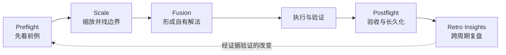

# Thinking Workflow Agent Skills

[English](README.en.md) · [Agent Skills 标准](https://agentskills.io/)

作为人文社科出身的工作者， 一名曾经的历史学教师，同时目前也在 FDE 前沿工作的人员，很高兴我可以向想要尝试 Vibe-coding 或想要了解AI工作流如何以结构主义打造的人们分享这一组 skills。

把一套个人思维习惯外化为五个可执行的 Agent Skills：先向外看，再缩放问题；吸收之后形成自己的解法；完成时用证据验收；跨周期让经验真正改变下一次行动。

这五个 Skills 最初服务于我的个人工作，适用于研究、产品、运营、写作、工程、工具治理和组织转型等不同任务。它们不是某个行业的专用方法，也不是五个彼此孤立的提示词，而是一套可以按需单独使用、也可以形成闭环的思维工作流。


## 五段思维闭环



| Skill | 它回答的问题 | 不替代什么 |
|---|---|---|
| [`preflight`](skills/preflight/) | 别人做过什么？什么值得借，什么不该做？ | 深度研究、方案设计、实施 |
| [`scale`](skills/scale/) | 同一问题要向外、向内和横向看到哪里，才能行动？ | 固定层级划分、详细方案 |
| [`fusion`](skills/fusion/) | 如何吸收多个方向的精华，形成自洽的新解法？ | 复制、拼贴、广泛找前例 |
| [`postflight`](skills/postflight/) | 结果真的完成了吗？能否恢复、维护和交接？ | 开工调研、继续扩项 |
| [`retro-insights`](skills/retro-insights/) | 多次任务后，哪些模式值得进入下一周期？ | 单次验收、自动改写长期规则 |

## 为什么开源

我希望公开的不是某家公司或某个项目的答案，而是一组可以迁移、讨论和继续改进的思考方式。

- 对个人：把隐性的思维习惯变成 Agent 可以重复执行的工作契约。
- 对协作者：让“为什么这样判断”比“最后给了什么答案”更容易被理解。
- 对 Skill 作者：讨论怎样把观点写成边界、步骤、停止条件和验收证据，而不只是写成长提示词。
- 对传统企业内部转型实践者：交流如何尊重既有流程、系统和一线经验，同时用小范围验证推动真实改变。

传统企业内部转型是这套 Skills 的一个重要分享方向，但不是它们的唯一适用场景。

## 哲学支撑

这些 Skills 与几类思想有明确亲缘关系：

- **实用主义**：一个观点的价值要落到行动后果和可验证结果上。
- **系统思维**：问题存在于关系、反馈和约束中，不能只优化孤立节点。
- **可错论**：方案只是当前证据下的最好解释，必须允许反例、纠正和回退。
- **辩证的综合**：融合不是取平均数，而是在矛盾和约束中重组出新的整体。
- **持续改进**：完成不是终点；但改进也不能脱离证据、无限扩张成新项目。

### 我的个人思维观

> 我相信外部世界先于内部想象。先承认别人可能已经做过，才能避免把熟悉感误当成创新。
>
> 我把边界看作服务当前决策的临时假设，向外、向内和横向移动，是为了保留真正影响行动的关系。
>
> 我认为创新是理解差异、舍弃噪音，再重新组织出一个自洽的新解法。
>
> 我不把“做过”当作“完成”。完成需要证据、可恢复性和可交接性；经验只有改变了下一次行动，才算真正沉淀。

因此，这套方法始终坚持五件事：**看见前例、追踪关系、形成新解、证据验收、跨周期学习**。

### 关于传统企业转型

我不把传统企业看作等待被技术“改造”的落后对象。它拥有长期形成的经验、关系与约束，也背负真实的惯性和代价。转型应先理解，再选择；先局部验证，再决定是否放大；既不迷信过去，也不迷信新技术。

## 快速安装

### 方式一：使用 Skills CLI

```bash
npx skills add Kyoyen/thinking-workflow-agent-skills
```

### 方式二：手动安装

```bash
git clone https://github.com/Kyoyen/thinking-workflow-agent-skills.git
mkdir -p ~/.agents/skills
cp -R thinking-workflow-agent-skills/skills/* ~/.agents/skills/
```

也可以只复制某一个 Skill 目录。安装后重新启动或刷新支持 Agent Skills 的客户端。

每个目录都遵循 `SKILL.md` 约定；`references/` 只在需要时加载，`scripts/` 用于适合确定性执行的辅助操作。

## 一般使用场景

| 场景 | 建议路径 |
|---|---|
| 面对陌生课题，担心闭门造车 | `preflight` |
| 一个问题越讨论越大或越拆越碎 | `scale` |
| 多个方案各有价值，需要形成自己的路线 | `fusion` |
| 代码、研究、文档、自动化或项目准备宣布完成 | `postflight` |
| 每周/月回看个人与 Agent 的协作方式 | `retro-insights` |
| 从一次想法走到可持续运行 | `preflight → scale → fusion → 执行 → postflight → retro-insights` |

## 场景示例

### 示例一：开始一个陌生主题的研究

`preflight` 先找已有概念、经典分歧、公开实践和失败方式；`scale` 再决定这次要回答到哪一层、哪些关系不能丢、哪里应停止。这样不会把“搜集了很多材料”误当成“已经定义了问题”。

### 示例二：把几个好方案变成自己的方案

`fusion` 不做 A+B+C 的功能拼盘。它先确认目标和不可复制边界，再把可借鉴部分降维成原则、结构和取舍，最后重新组织出整体方案。

### 示例三：给一项工作真正收尾

`postflight` 可以用于代码、文档、调研、设计或自动化：逐项核对承诺、证据、未验证项、回滚、Owner 和下一步。没有打开过、运行过或回读过的结果，不写成“已完成”。

### 示例四：复盘个人与 Agent 的长期协作

`retro-insights` 不按会话数、Token、提交数或文档数评价价值，而是寻找多次任务中重复出现的成功模式、摩擦和用户纠正。单次现象只作观察；重复、影响明确或经使用者确认后，才建议进入规则、Skill、脚本或运行手册。

### 示例五：传统企业内部转型

面对流程、系统、权限和一线经验交织的问题，先查已有能力，再沿真实关系缩放；把外部实践与内部条件融合成最小可验证改动；交付后保留验收、恢复和反馈证据。传统企业的合成示例见 [`examples/thinking-workflow-examples.md`](examples/thinking-workflow-examples.md)。

## 使用边界

- 这些 Skills 提供判断流程，不替代领域专家、业务负责人、合规、法律或安全审查。
- 不要把公开案例直接套用到自己的环境；边界、权限、数据和验收必须重新确认。
- 不要向模型提供无权处理的客户资料、内部日志、账号、密钥或个人信息。
- `retro-insights` 的会话清单脚本默认隐藏本地路径和会话标识；只有明确需要时才选择性开放。
- 用于关键任务前，请在自己的环境中测试和评审。

完整说明见 [`PRIVACY.md`](PRIVACY.md)。

## 仓库结构

```text
.
├── skills/
│   ├── preflight/
│   ├── scale/
│   ├── fusion/
│   ├── postflight/
│   └── retro-insights/
├── examples/
├── CONTRIBUTING.md
├── PRIVACY.md
└── LICENSE
```

## 参与交流

欢迎通过 GitHub Discussions 分享经过脱敏的使用经验，通过 Issues 提交问题或建议，通过 Pull Requests 改进通用方法。提交前请阅读 [`CONTRIBUTING.md`](CONTRIBUTING.md)，不要上传任何组织、客户或个人的可识别信息。

页面结构参考了 [OpenAI Skills](https://github.com/openai/skills)、[Anthropic Skills](https://github.com/anthropics/skills)、[Microsoft Agent Skills](https://github.com/MicrosoftDocs/Agent-Skills) 与 [NVIDIA Skills](https://github.com/NVIDIA/skills) 的公开呈现方式；本仓库的观点、结构、文字和示例均为独立整理。

## License

[MIT License](LICENSE)

## Contact

交流邮箱：[lumon.merrifort@foxmail.com](mailto:lumon.merrifort@foxmail.com)
