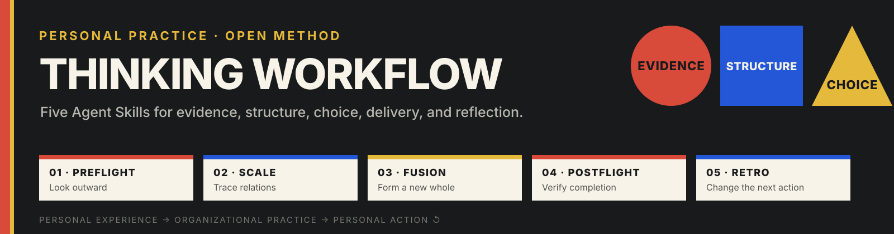
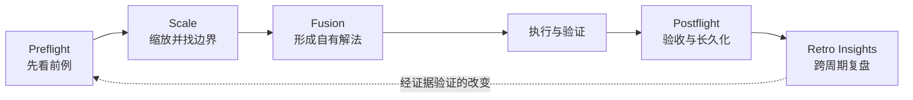
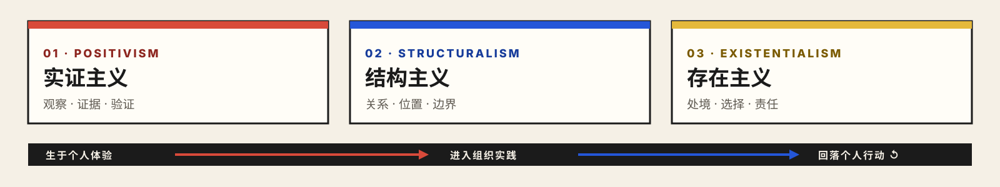

# Thinking Workflow Agent Skills

<p>
  <a href="README.en.md">English</a> ·
  <a href="https://agentskills.io/">Agent Skills 标准</a>
</p>

<p align="center">
  
</p>

作为人文社科出身的工作者、曾经的历史学教师，以及目前在 FDE 前沿工作的一员，我很高兴把这组 Skills 分享给正在尝试 Vibe Coding、理解 AI 工作流，或希望从结构主义视角组织复杂工作的人。

这组 Skills 把我的个人思维习惯外化为五个可执行的 Agent Skills：先向外看，再缩放问题；吸收之后形成自己的解法；完成时用证据验收；跨周期让经验真正改变下一次行动。

## 一条宽路由

它们从个人体验中生长，在组织与企业场景中接受复杂关系的检验，最后回到个人的判断、选择和行动。五段式分析提供稳定骨架，每个 Skill 也保留独立入口。

| 01 · 生于个人 | 02 · 进入组织 | 03 · 回落个人 |
|---|---|---|
| 个人经验、问题意识、价值判断和工作习惯成为方法的起点。 | 协作、流程、权限、系统与共同目标让方法接受更大关系网络的检验。 | 证据、反例和复盘重新进入个人实践，改变下一次选择。 |

这条路由容纳研究、产品、运营、写作、工程、工具治理、组织转型与日常个人决策。实际任务可以从任一段进入，再按需要连接其他阶段。

## 选择语言版本

仓库提供两套完整版本。每一套都包含五个 Skill、界面元数据、参考资料和辅助脚本；两套版本保持相同的方法、阶段边界与调用名。

| 版本 | 入口 | 适合 |
|---|---|---|
| 中文版 | [`editions/zh-CN/skills/`](editions/zh-CN/skills/) | 希望 Agent 的说明、模板与脚本输出使用中文 |
| 英文版 | [`editions/en/skills/`](editions/en/skills/) | 希望 Agent 的说明、模板与脚本输出使用英文 |

请选择一套安装。两套版本使用相同的 Skill 名称，同时安装会产生同名覆盖或发现冲突。

## 五段式分析



| Skill | 中文版 | 英文版 | 核心问题 |
|---|---|---|---|
| `preflight` | [打开](editions/zh-CN/skills/preflight/) | [打开](editions/en/skills/preflight/) | 别人做过什么？什么值得借，什么应当舍弃？ |
| `scale` | [打开](editions/zh-CN/skills/scale/) | [打开](editions/en/skills/scale/) | 同一问题要向外、向内和横向看到哪里，才能行动？ |
| `fusion` | [打开](editions/zh-CN/skills/fusion/) | [打开](editions/en/skills/fusion/) | 如何吸收多个方向的精华，形成自洽的新解法？ |
| `postflight` | [打开](editions/zh-CN/skills/postflight/) | [打开](editions/en/skills/postflight/) | 结果真的完成了吗？能否恢复、维护和交接？ |
| `retro-insights` | [打开](editions/zh-CN/skills/retro-insights/) | [打开](editions/en/skills/retro-insights/) | 多次任务后，哪些模式值得进入下一周期？ |

## 哲学支撑

<p align="center">
  
</p>

### 实证主义

可观察事实、可复核材料和实际结果构成判断的起点。`preflight` 要求查看真实前例，`postflight` 要求完成证据，`retro-insights` 要求跨任务重复与验证。观点通过证据获得暂时可信度，也持续向新证据开放。

### 结构主义

问题的意义来自关系、位置、差异、约束与反馈。`scale` 沿同一关注点向外、向内和横向移动，`fusion` 把多个来源放进同一目标结构中重新组织。边界服务当前决策，并随关系变化接受修订。

### 存在主义

人始终处在具体情境中，通过选择和行动承担责任。Skill 提供观察与判断结构，实际选择仍由行动者完成。五段闭环最终回到个人：我如何理解处境、做出选择、承担结果，并让经验改变下一次行动。

| 哲学线索 | 在工作流中的投影 | 主要承载 |
|---|---|---|
| 实证主义 | 以事实、证据、结果和可复核性约束判断 | `preflight`、`postflight`、`retro-insights` |
| 结构主义 | 通过关系、边界和整体结构理解问题 | `scale`、`fusion` |
| 存在主义 | 在具体处境中选择、行动、负责并回到个人 | 执行、`postflight`、`retro-insights` |

## 为什么开源

我希望这组 Skills 让个人思维方式变得可阅读、可使用、可讨论：

- 对个人：把隐性的判断习惯写成 Agent 可以执行的工作契约。
- 对协作者：让判断依据、范围边界和完成证据保持可见。
- 对 Skill 作者：交流观点如何进入触发条件、步骤、停止条件和验收结构。
- 对组织实践者：观察个人方法如何进入协作系统，并通过组织实践回到个人成长。
- 对传统企业内部转型实践者：交流既有流程、系统和一线经验如何参与小范围验证与真实改变。

## 快速安装

先克隆仓库，再复制其中一套：

```bash
git clone https://github.com/Kyoyen/thinking-workflow-agent-skills.git
mkdir -p ~/.agents/skills
cp -R thinking-workflow-agent-skills/editions/zh-CN/skills/* ~/.agents/skills/
```

英文版将最后一行替换为：

```bash
cp -R thinking-workflow-agent-skills/editions/en/skills/* ~/.agents/skills/
```

也可以只复制一个 Skill 目录，例如中文版 `editions/zh-CN/skills/preflight/`。安装后重新启动或刷新支持 Agent Skills 的客户端。

每个目录都遵循 `SKILL.md` 约定；`references/` 按需加载，`scripts/` 承担适合确定性执行的辅助操作。

## 一般使用场景

| 场景 | 建议路径 |
|---|---|
| 面对陌生课题，需要借鉴已有思想与实践 | `preflight` |
| 一个问题越讨论越大或越拆越碎 | `scale` |
| 多个方案各有价值，需要形成自己的路线 | `fusion` |
| 代码、研究、文档、自动化或项目准备宣布完成 | `postflight` |
| 每周或每月回看个人与 Agent 的协作方式 | `retro-insights` |
| 从一次想法走到可持续运行 | `preflight → scale → fusion → 执行 → postflight → retro-insights` |

## 场景示例

### 示例一：开始一个陌生主题的研究

`preflight` 先找已有概念、经典分歧、公开实践和失败方式；`scale` 再决定这次要回答到哪一层、哪些关系需要保留、哪里应当停止。研究成果同时包含材料与清晰的问题边界。

### 示例二：把几个好方案变成自己的方案

`fusion` 先确认目标和可使用边界，再把可借鉴部分降维成原则、结构和取舍，最终形成一个自洽的新方案。

### 示例三：给一项工作真正收尾

`postflight` 可以用于代码、文档、调研、设计或自动化：逐项核对承诺、证据、未验证项、回滚、负责人和下一步。只有实际打开、运行或回读过的结果才标记为完成。

### 示例四：复盘个人与 Agent 的长期协作

`retro-insights` 依据真实结果、交付证据、重复模式、摩擦和用户纠正评价价值。跨任务重复、影响明确或经使用者确认的模式，可以进入规则、Skill、检查脚本或运行手册。

### 示例五：传统企业内部转型

面对流程、系统、权限和一线经验交织的问题，先查已有能力，再沿真实关系缩放；把外部实践与内部条件融合成最小可验证改动；交付后保留验收、恢复和反馈证据。更多合成示例见 [`examples/thinking-workflow-examples.md`](examples/thinking-workflow-examples.md)。

## 使用边界

- 这些 Skills 提供判断流程；领域专家、业务负责人、合规、法律和安全审查继续承担各自责任。
- 公开案例进入具体环境时，需要重新确认边界、权限、数据和验收。
- 模型输入应当限定在使用者有权处理的材料范围内。
- `retro-insights` 的会话清单脚本默认隐藏本地路径和会话标识；本地细节只在明确开启时输出。
- 关键任务进入实际使用前，需要在对应环境中完成测试和评审。

完整说明见 [`PRIVACY.md`](PRIVACY.md)。

## 仓库结构

```text
.
├── docs/assets/
├── editions/
│   ├── zh-CN/skills/
│   │   ├── preflight/
│   │   ├── scale/
│   │   ├── fusion/
│   │   ├── postflight/
│   │   └── retro-insights/
│   └── en/skills/
│       └── 与中文版保持相同的五个目录
├── examples/
├── CONTRIBUTING.md
├── PRIVACY.md
└── LICENSE
```

## 参与交流

欢迎通过 GitHub Discussions 分享经过脱敏的使用经验，通过 Issues 提交问题或建议，通过 Pull Requests 改进通用方法。提交前请阅读 [`CONTRIBUTING.md`](CONTRIBUTING.md)，并移除组织、客户或个人的可识别信息。

页面结构参考了 [OpenAI Skills](https://github.com/openai/skills)、[Anthropic Skills](https://github.com/anthropics/skills)、[Microsoft Agent Skills](https://github.com/MicrosoftDocs/Agent-Skills) 与 [NVIDIA Skills](https://github.com/NVIDIA/skills) 的公开呈现方式；本仓库的观点、结构、文字、示例和视觉资产均为独立整理。

## License

[MIT License](LICENSE)

## Contact

交流邮箱：[lumon.merrifort@foxmail.com](mailto:lumon.merrifort@foxmail.com)
